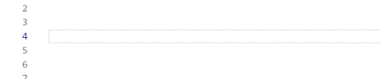
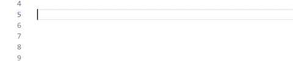

# :vs: vscode comment-box 

## :jp: 日本語
## :information_source: 概要
- vscodeで枠線付きのコメントを生成します
- 次の2種類のコメントが生成できます
  - ラインコメントによる区切り線
    - 
  - ブロックコメントによる枠線つきコメント
    -   

## :white_check_mark: インストール方法 (VSIX)
1. [Releases](https://github.com/KaiManabe/vscode-commentbox/releases) > `Assets` より最新のvsixをダウンロード
2. vscodeを起動 > 拡張機能タブを開く
3. 右上 `・・・` ボタン ＞ `VSIXからのインストール`
4. ダウンロードしたVSIXを選択しインストール

## :memo: 使い方
- スニペット等はデフォルトの値が示されていますが，[設定](#wrench-設定)に従って変更することができます
  
### 1. ラインコメント
1. `---任意のコメント任意のコメント任意のコメント---`と入力します
2. 補完候補`Generate oneline comment`が表示されたらEnterを押します
3. (vscodeの仕様上，**言語によってはSpaceを押してからEnterを押さないと反応しません**)
  
### 2. ブロックコメント
1. `===任意のコメント任意のコメント任意のコメント===`と入力します
2. 補完候補`Generate multi-line comment`が表示されたらEnterを押します
3. (vscodeの仕様上，**言語によってはSpaceを押してからEnterを押さないと反応しません**)

## :wrench: 設定
1. `ctrl + ,` (デフォルト)で設定を開きます
2. 検索窓に `commentBox` を入力すると設定が出ます
3. [CONFIG.md](./media/CONFIG.md)にしたがって設定を変更できます

## :beginner: 免責事項
- **実務未経験のガキンチョが作りました**
- ので，使用する場合自己責任での使用をお願いします

 
 

## :us: English (By translator)

## :information_source: Overview

- Generates bordered comments in VSCode
- Supports two types of comments:

  - Divider line using line comments

    - 
  - Bordered comment using block comments

    - 

## :white_check_mark: Installation (VSIX)

1. Go to [Releases](https://github.com/KaiManabe/vscode-commentbox/releases) and download the latest `.vsix` from `Assets`
2. Open VSCode and go to the Extensions tab
3. Click the `...` button at the top right > `Install from VSIX...`
4. Select the downloaded VSIX file to install

## :memo: Usage

- The default snippet values can be customized according to the [Settings](#wrench-settings)

### 1. Line Comment

1. Type `---your comment your comment your comment---`
2. When the completion suggestion `Generate oneline comment` appears, press Enter
3. (Due to vscode specifications, **some languages do not respond unless Space is pressed and then Enter is pressed**.)

### 2. Block Comment

1. Type `===your comment your comment your comment===`
2. When the completion suggestion `Generate multi-line comment` appears, press Enter
3. (Due to vscode specifications, **some languages do not respond unless Space is pressed and then Enter is pressed**.)

## :wrench: Settings

1. Open settings with `Ctrl + ,` (default)
2. Search for `commentBox` in the search bar
3. You can customize settings according to [CONFIG.md](./media/CONFIG.md)

## :beginner: Disclaimer

- **This extension was made by an inexperienced hobbyist**
- Please use it at your own risk
